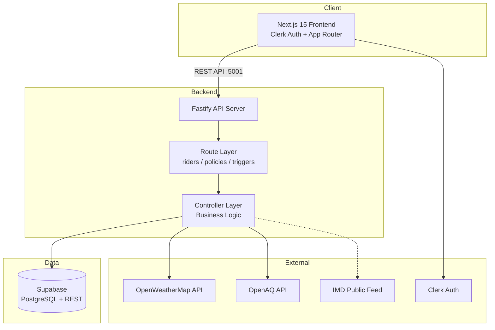
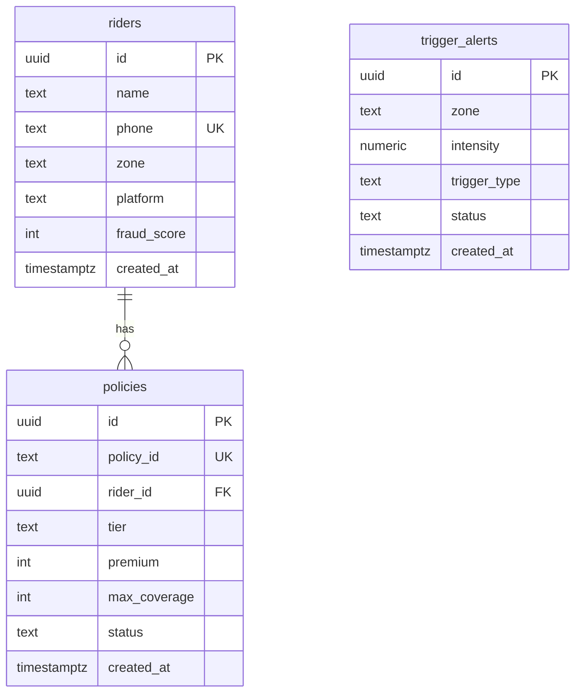
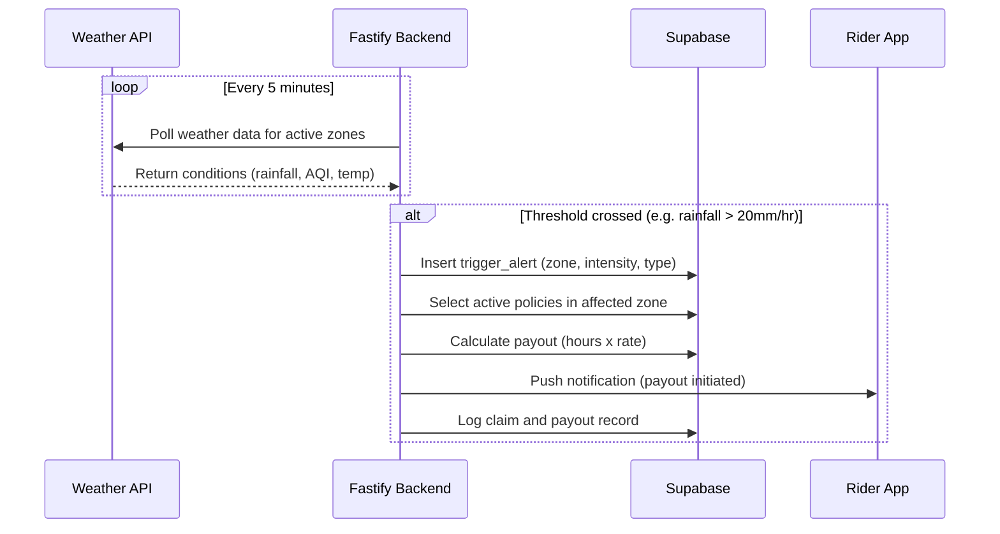

# GigShield Architecture

## System Overview

GigShield is a parametric income insurance platform for Q-Commerce delivery partners. The system monitors real-time environmental conditions (weather, AQI, civil disruptions) and automatically triggers payouts when predefined thresholds are crossed in a rider's active zone.



## Database Schema



## Directory Structure

```text
gigshield/
├── backend/                # Fastify API server
│   ├── controllers/        # Request handlers (rider, policy, trigger)
│   ├── routes/             # Fastify route plugins
│   ├── lib/supabase.js     # Supabase client singleton
│   ├── db/                 # SQL migrations
│   ├── index.js            # Server entry point
│   ├── Dockerfile
│   └── package.json
├── frontend/               # Next.js 15 App Router + Clerk
│   ├── app/
│   │   ├── layout.jsx      # Root layout (ClerkProvider, CSS)
│   │   ├── page.jsx        # Root redirect -> /dashboard
│   │   ├── sign-in/        # Clerk custom sign-in
│   │   ├── sign-up/        # Clerk custom sign-up
│   │   ├── onboarding/     # Zone/platform selection
│   │   ├── dashboard/      # Main dashboard
│   │   ├── trigger/        # Live trigger monitor
│   │   ├── policy/         # Policy details
│   │   ├── claims/         # Claims history
│   │   ├── mycoverage/     # Coverage breakdown
│   │   └── components/     # Header (Clerk UserButton)
│   ├── lib/api.js          # Axios API service
│   ├── middleware.js        # Clerk route protection
│   ├── Dockerfile
│   └── package.json
├── docs/
│   ├── architecture.md     # This file
│   └── PRD.md
├── docker-compose.yml      # backend + frontend
├── .env                    # Backend + Supabase keys
├── .env.example
├── package.json            # Root workspace scripts
└── README.md
```

## API Endpoints

| Method | Endpoint                 | Description                  |
|--------|--------------------------|------------------------------|
| POST   | `/api/riders/onboarding` | Register a new rider         |
| GET    | `/api/riders/:id`        | Get rider profile by ID      |
| POST   | `/api/policies/issue`    | Issue a new weekly policy    |
| GET    | `/api/policies/:policyId`| Get policy details           |
| GET    | `/api/triggers/alerts`   | Get latest 10 trigger alerts |
| POST   | `/api/triggers/simulate` | Simulate a trigger event     |

## Parametric Trigger Flow



## Running Locally

```bash
# Install all dependencies
npm run install:all

# Start both backend and frontend in dev mode
npm run dev

# Backend runs on http://localhost:5001
# Frontend runs on http://localhost:3000
```

## Running with Docker

```bash
docker compose up --build
docker compose down
```
