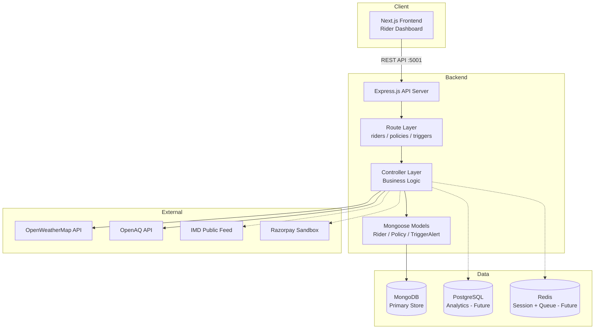
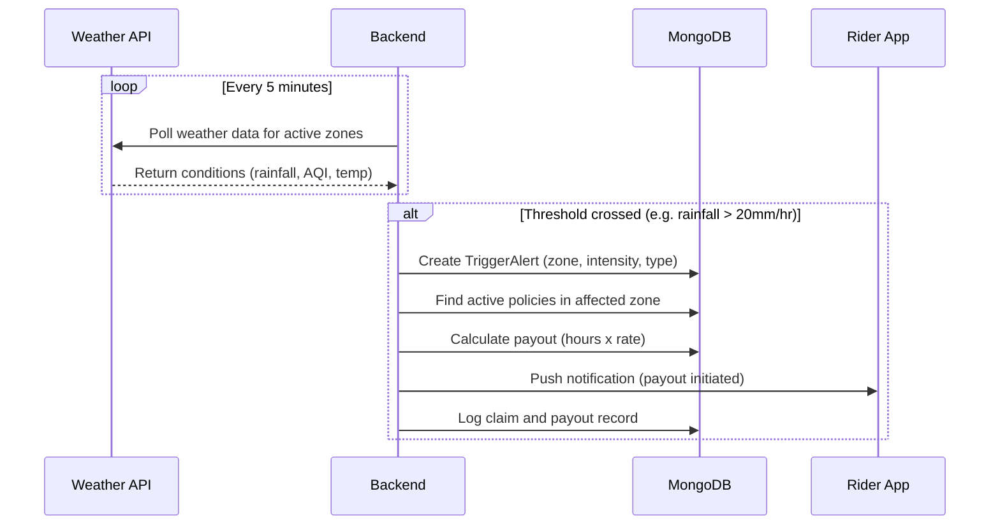

# GigShield Architecture

## System Overview

GigShield is a parametric income insurance platform for Q-Commerce delivery partners. The system monitors real-time environmental conditions (weather, AQI, civil disruptions) and automatically triggers payouts when predefined thresholds are crossed in a rider's active zone.



## Directory Structure

```
gigshield/
├── backend/                # Express.js API server
│   ├── controllers/        # Request handlers (rider, policy, trigger)
│   ├── models/             # Mongoose schemas (Rider, Policy, TriggerAlert)
│   ├── routes/             # Express route definitions
│   ├── index.js            # Server entry point
│   ├── package.json
│   ├── Dockerfile
│   └── .env.example
├── frontend/               # Next.js 15 App Router
│   ├── app/                # Pages and layouts
│   │   ├── layout.jsx      # Root layout (metadata, global CSS)
│   │   ├── page.jsx        # Root redirect -> /login
│   │   ├── login/          # Login screen
│   │   ├── onboarding/     # Multi-step onboarding wizard
│   │   ├── dashboard/      # Main dashboard (metrics, alerts, map)
│   │   ├── trigger/        # Live trigger monitoring view
│   │   ├── policy/         # Policy details and documents
│   │   ├── claims/         # Claims history and settlement log
│   │   ├── mycoverage/     # Detailed coverage breakdown
│   │   └── components/     # Shared components (Header)
│   ├── lib/                # API service layer
│   ├── public/             # Static assets (logo, icons)
│   ├── Dockerfile
│   └── package.json
├── docs/                   # Project documentation
│   ├── architecture.md     # This file
│   └── PRD.md              # Product Requirements Document
├── docker-compose.yml      # Full-stack orchestration
├── package.json            # Root workspace scripts
└── README.md
```

## API Endpoints

| Method | Endpoint                      | Description                    |
|--------|-------------------------------|--------------------------------|
| POST   | `/api/riders/onboarding`      | Register a new rider           |
| GET    | `/api/riders/:id`             | Get rider profile by ID        |
| POST   | `/api/policies/issue`         | Issue a new weekly policy       |
| GET    | `/api/policies/:policyId`     | Get policy details             |
| GET    | `/api/triggers/alerts`        | Get latest 10 trigger alerts   |
| POST   | `/api/triggers/simulate`      | Simulate a trigger event       |

## Data Models

### Rider

| Field       | Type     | Description                     |
|-------------|----------|---------------------------------|
| name        | String   | Rider full name                 |
| phone       | String   | Phone number (unique)           |
| zone        | String   | Operating zone (pin code area)  |
| platform    | String   | Delivery platform               |
| fraudScore  | Number   | Rolling fraud score (0-100)     |

### Policy

| Field       | Type     | Description                     |
|-------------|----------|---------------------------------|
| policyId    | String   | Unique policy identifier        |
| riderId     | ObjectId | Reference to Rider              |
| tier        | Enum     | Basic / Standard / Pro          |
| premium     | Number   | Weekly premium amount            |
| maxCoverage | Number   | Maximum weekly payout            |
| status      | Enum     | Active / Expired / Cancelled    |

### TriggerAlert

| Field       | Type     | Description                     |
|-------------|----------|---------------------------------|
| zone        | String   | Affected zone                   |
| intensity   | Number   | Measured intensity value         |
| triggerType | String   | Rainfall / AQI / Heat / Curfew  |
| status      | Enum     | Active / Resolved               |

## Parametric Trigger Flow



## Running Locally

```bash
# Install all dependencies
npm run install:all

# Start both backend and frontend in dev mode
npm run dev

# Backend runs on http://localhost:5001
# Frontend runs on http://localhost:3000
```

## Running with Docker

```bash
# Build and start all services
docker compose up --build

# Stop all services
docker compose down
```
